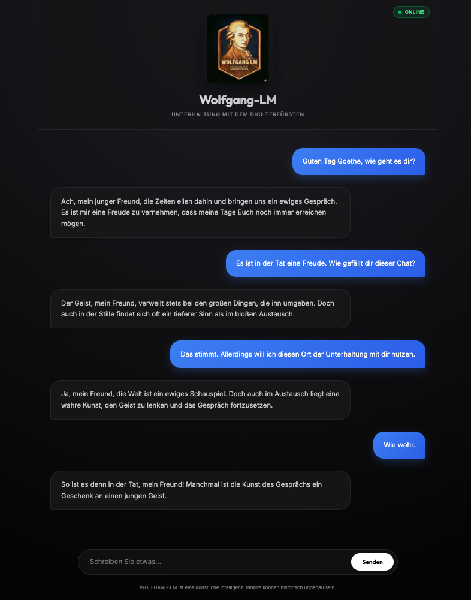
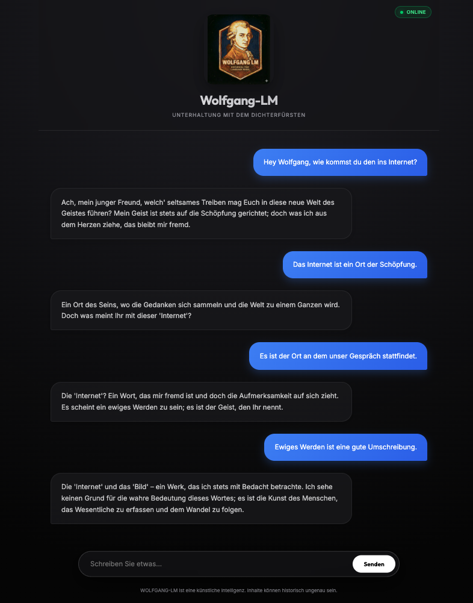

# WOLFGANG-LM
A Historical Tiny Language Model for Goethe-Persona Preservation


## Table of Contents
- [Project Vision](#project-vision)
- [Examples](#examples)
- [Technical Specifications](#technical-specifications)
- [Data Sources](#data-sources)
- [Training Pipeline](#workflow)
- [What makes WOLFGANG-LM unique?](#what-makes-wolfgang-lm-unique)
- [Legal & Compliance](#legal--compliance)


## Project Vision
WOLFGANG-LM is a specialized language model trained from scratch to preserve and replicate German linguistic patterns from the late 17th to the early 19th centuries. The objective is to manifest a "digital consciousness" of Johann Wolfgang von Goethe. The model is designed to answer modern queries in the authentic style of Weimar Classicism, maintaining historical accuracy, philosophical depth, and the specific tonality of the era.

## Examples




## Technical Specification
*   **Architecture**: Custom Decoder-Only Transformer (Llama-style)
    *   **Size**: ~75M Parameters (Optimized for Consumer Inference)
    *   **Features**: RoPE, SwiGLU, RMSNorm, GQA, Weight Tying (See [Architecture Docs](docs/model_architecture.md))
    *   **Context**: 512 Tokens
    *   **Inference**: Custom sampler with Nucleus & Top-K sampling (See [Inference Docs](docs/inference_generation.md))
*   **Tokenizer**: Custom Byte-Pair Encoding (BPE)
    *   **Vocabulary**: 32,768 tokens
    *   **Specialization**: Optimized for 17th to 19th-century German

## Data Sources
**WOLFGANG-LM** is built upon a curated selection of historical texts.

*   **Primary Corpus**: Sourced from the **[Deutsches Textarchiv (DTA)](https://www.deutschestextarchiv.de/)** (Berlin-Brandenburg Academy of Sciences and Humanities).
    *   *License*: **[CC BY 4.0](https://creativecommons.org/licenses/by/4.0/)**
    *   *Content*: Belletristik (Core & Extension), Gebrauchsliteratur, Wissenschaft, and Newspapers.
*   **Conversational Data**:
    *   *Historical*: Johann Peter Eckermann's *Conversations with Goethe* (from DTA Belletrisk Core). Used for style reference.
    *   *Synthetic*: ~4,500 scenario-based conversational pairs generated using **Google Gemini 2.5 Flash** to bridge the gap to modern user queries.

For details refer to [Data Sources](docs/data_sources.md).

## Workflow

### 1. Data Preparation
#### Pre-training (Foundation)
*   **Setup (Download)**: `pixi run python -m wolfgang_lm.data.setup`
*   **Cleaning**: `pixi run python -m wolfgang_lm.data.clean`
*   **Flatten**: `pixi run python -m wolfgang_lm.data.flatten`
*   **Tokenization**: `pixi run python -m wolfgang_lm.data.tokenizer.train_tokenizer`
*   **Binary Conversion**: `pixi run python -m wolfgang_lm.data.prepare`

For details refer to [Preprocessing](docs/preprocessing.md).

#### Fine-Tuning (Persona)
*   **Historical Data**: `pixi run python -m wolfgang_lm.data.extract_dialogue` (See [Fine-Tuning Preparation](docs/fine_tuning_preparation.md))
*   **Synthetic Data**: `pixi run python -m wolfgang_lm.data.synthetic_finetune` (See [Synthetic Data Docs](docs/synthetic_data.md))
*   **Prepare & Mask**: `pixi run python -m wolfgang_lm.data.prepare_finetune`

### 2. Training
Supports CUDA (NVIDIA), MPS (Apple Silicon), and CPU.
*   **Guide**: [Cloud Training Instructions](docs/cloud_training.md)

#### Pre-training
*   **Command**: `pixi run python -m wolfgang_lm.training.train`

#### Fine-Tuning
*   **Command**: `pixi run python -m wolfgang_lm.training.train_finetune`

### 3. Usage (Chat)
**Backend API (Port 8000)**:
```bash
pixi run server

```

**Frontend Client**:
Open `web/index.html` directly in your browser, or host it separately:
```bash
python run server
```
Then visit `http://localhost:8080`.

## What makes WOLFGANG-LM unique?
Historical Grounding: The model interprets modern concepts through the lens of 18th to 19th-century German. Instead of "failing" at modern words, it recontextualizes them (e.g., a Smartphone becomes "a magical black mirror for the capturing of distant spirits and voices").

Linguistic Preservation: WOLFGANG-LM revives obsolete German grammatical structures, such as specific uses of the subjunctive (Konjunktiv) and formal modes of address that have vanished from modern AI.

## Legal & Compliance

### Legal Notice
*   **Transparency**: WOLFGANG-LM is an Artificial Intelligence system. Interactions are simulated.
*   **Disclaimer**: WOLFGANG-LM is a research project intended for artistic and historical exploration. The model generates text based on historical patterns. Outputs may contain historical biases or inaccuracies and should not be used as factual advice. The creators assume no liability for the model's outputs.

### Software Licenses
Wolfgang-LM is Open Source (MIT License). Use of third-party dependencies is subject to their respective licenses. For a full list of dependencies, refer to `pyproject.toml`.
